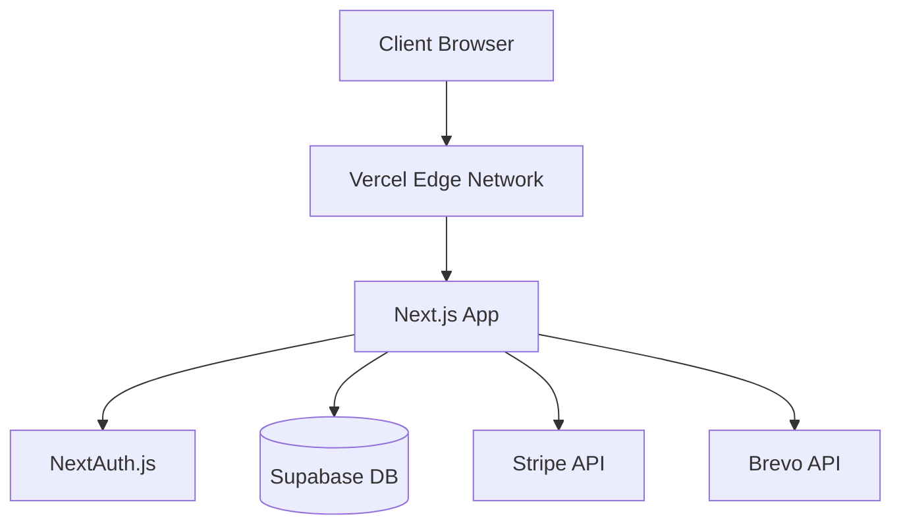

# 🚀 Guide Zero Cost SaaS 2025
> Comment lancer un SaaS professionnel sans dépenser 1€

## 📋 Table des Matières
1. [Architecture Complète Gratuite](#architecture-complète-gratuite)
2. [Limites des Tiers Gratuits](#limites-exactes-des-tiers-gratuits)
3. [Pièges à Éviter](#-pièges-à-éviter)
4. [Guide d'Implémentation](#-guide-dimplémentation-étape-par-étape)
5. [Stratégies pour Rester Gratuit](#-stratégies-pour-rester-gratuit)
6. [Quand Migrer vers le Payant](#-quand-migrer-vers-le-payant)

---

## 🏗️ Architecture Complète Gratuite

### Stack Technique Recommandée

```typescript
// Frontend & Backend
Framework: Next.js 14+ (App Router)
Hosting: Vercel Hobby Plan
Runtime: Node.js 20

// Authentication
Auth: NextAuth.js v5 (Auth.js) + Provider OAuth gratuits
Backup: Supabase Auth (50,000 MAU gratuits)

// Database
Primary: PostgreSQL via Supabase (500MB)
Alternative: Neon.tech (0.5GB) ou PlanetScale (5GB MySQL)
ORM: Prisma (open source)

// Paiements
Processor: Stripe (0€ setup, commission sur ventes uniquement)
Alternative EU: Paddle (gère TVA automatiquement)

// UI & Design
Components: shadcn/ui (100% gratuit)
Icons: Lucide React (open source)
CSS: TailwindCSS

// Emails
Transactional: Brevo (300/jour gratuit)
Backup: Resend (100/mois) ou Gmail SMTP
Templates: React Email

// Analytics & Monitoring
Analytics: Umami (self-hosted) ou GA4
Errors: Sentry (5K events/mois)
Logs: Vercel Functions Logs

// Storage
Files: Supabase Storage (1GB)
Images: Cloudinary (25GB bandwidth)
Alternative: Uploadthing (2GB)
```

### Architecture Système



---

## 📊 Limites Exactes des Tiers Gratuits

### Hosting & Infrastructure

| Service | Limite Gratuite | Suffisant Pour | ⚠️ Attention |
|---------|----------------|----------------|--------------|
| **Vercel Hobby** | 100GB bandwidth/mois | ~100K visiteurs | Pas de team features |
| | 100 heures build/mois | Deploy quotidiens | |
| | 1000 images optimisées | Site complet | |
| **Netlify Free** | 100GB bandwidth | Alternative Vercel | Build plus lent |
| **Railway Trial** | $5 credit | Tests seulement | Expire après 1 mois |

### Databases

| Service | Limite Gratuite | Suffisant Pour | ⚠️ Attention |
|---------|----------------|----------------|--------------|
| **Supabase** | 500MB DB | ~100K records | 2GB bandwidth/mois |
| | 50K MAU auth | PME | Pause après 7j inactivité |
| | 1GB storage | 10K images | |
| **Neon** | 0.5GB storage | ~50K records | 100 heures compute/mois |
| **PlanetScale** | 5GB MySQL | ~500K records | 1 milliard row reads |
| **MongoDB Atlas** | 512MB | ~50K documents | Shared cluster |

### Authentication

| Service | Limite Gratuite | Suffisant Pour | ⚠️ Attention |
|---------|----------------|----------------|--------------|
| **NextAuth.js** | Illimité | Tout | Config plus complexe |
| **Supabase Auth** | 50K MAU | Grande startup | Inclus dans Supabase |
| **Clerk** | 10K MAU | Petite startup | $25/mois après |
| **Auth0** | 7K MAU | Test seulement | Cher après |

### Emails

| Service | Limite Gratuite | Suffisant Pour | ⚠️ Attention |
|---------|----------------|----------------|--------------|
| **Brevo** | 300 emails/jour | Startup | 9K/mois max |
| **Resend** | 100 emails/mois | Dev only | 3 emails/jour |
| **SendGrid** | 100 emails/jour | Petit SaaS | 3K/mois max |
| **Gmail SMTP** | 500 emails/jour | Bon début | Peut être bloqué |
| **Mailgun** | 1000 emails/mois | Tests | 3 mois seulement |

### Analytics & Monitoring

| Service | Limite Gratuite | Suffisant Pour | ⚠️ Attention |
|---------|----------------|----------------|--------------|
| **Google Analytics** | Illimité | Tout | RGPD complexe |
| **Umami** | Self-hosted illimité | Tout | Consomme Vercel bandwidth |
| **Plausible** | 30 jours trial | Test only | $9/mois après |
| **Sentry** | 5K errors/mois | PME | Rate limiting agressif |
| **LogRocket** | 1K sessions/mois | Debug | Privacy concerns |

### Storage & CDN

| Service | Limite Gratuite | Suffisant Pour | ⚠️ Attention |
|---------|----------------|----------------|--------------|
| **Cloudinary** | 25GB bandwidth | 25K images vues | 25K transformations |
| **Uploadthing** | 2GB storage | 20K images | Bandwidth limitée |
| **ImageKit** | 20GB bandwidth | 20K images vues | |
| **Supabase Storage** | 1GB | 10K images | Inclus dans plan |

---

## ⚠️ Pièges à Éviter

### 🔴 Pièges Critiques

#### 1. Supabase Pause Automatique
```javascript
// ❌ PIÈGE: Votre DB s'arrête après 7 jours d'inactivité
// ✅ SOLUTION: Cron job quotidien
// Ajouter dans vercel.json
{
  "crons": [{
    "path": "/api/keep-alive",
    "schedule": "0 0 * * *"
  }]
}

// api/keep-alive/route.ts
export async function GET() {
  await prisma.user.count(); // Simple query
  return Response.json({ alive: true });
}
```

#### 2. Vercel Serverless Timeout
```javascript
// ❌ PIÈGE: Timeout 10s en gratuit (vs 60s en pro)
// ✅ SOLUTION: Background jobs avec queue

// Mauvais
export async function POST(req) {
  await processLargeDataset(); // Peut timeout
}

// Bon
export async function POST(req) {
  // Démarrer le job en background
  await supabase.from('jobs').insert({ 
    type: 'process_data',
    status: 'pending' 
  });
  
  // Répondre immédiatement
  return Response.json({ status: 'processing' });
}
```

#### 3. Rate Limiting Email
```javascript
// ❌ PIÈGE: Brevo limite à 300/jour
// ✅ SOLUTION: File d'attente intelligente

class EmailQueue {
  async send(email) {
    const todayCount = await this.getTodayCount();
    
    if (todayCount >= 290) { // Garder marge
      // Reporter à demain
      await this.scheduleForTomorrow(email);
      return;
    }
    
    await this.sendNow(email);
  }
}
```

#### 4. Bandwidth Vercel
```javascript
// ❌ PIÈGE: 100GB/mois part vite avec images
// ✅ SOLUTION: Optimisation aggressive

// next.config.js
module.exports = {
  images: {
    formats: ['image/avif', 'image/webp'],
    deviceSizes: [640, 828, 1200], // Moins de tailles
    minimumCacheTTL: 31536000, // 1 an cache
  }
}

// Utiliser Cloudinary pour images user
const uploadImage = async (file) => {
  // Upload vers Cloudinary, pas Vercel
  return await cloudinary.upload(file);
}
```

### 🟡 Pièges Courants

#### 5. OAuth Providers Limites
```javascript
// ❌ Google OAuth a des quotas cachés
// ✅ Utiliser plusieurs providers

// auth.config.ts
export const authConfig = {
  providers: [
    GoogleProvider({
      allowDangerousEmailAccountLinking: true,
    }),
    GithubProvider({}), // Backup
    EmailProvider({}), // Magic links comme fallback
  ]
}
```

#### 6. Prisma Cold Starts
```javascript
// ❌ PIÈGE: Prisma = +2s cold start
// ✅ SOLUTION: Connection pooling

// lib/prisma.ts
const globalForPrisma = global as unknown as {
  prisma: PrismaClient | undefined
}

export const prisma = globalForPrisma.prisma || 
  new PrismaClient({
    datasources: {
      db: {
        url: process.env.DATABASE_URL + '?pgbouncer=true'
      }
    }
  })

if (process.env.NODE_ENV !== 'production') {
  globalForPrisma.prisma = prisma
}
```

#### 7. Vendor Lock-in
```javascript
// ❌ PIÈGE: Trop dépendre d'un service
// ✅ SOLUTION: Abstraction layers

// lib/email/index.ts
interface EmailProvider {
  send(email: Email): Promise<void>
}

class EmailService {
  private providers: EmailProvider[] = [
    new BrevoProvider(),
    new ResendProvider(), // Fallback
    new SMTPProvider(), // Emergency
  ]
  
  async send(email: Email) {
    for (const provider of this.providers) {
      try {
        return await provider.send(email);
      } catch (e) {
        continue; // Try next
      }
    }
  }
}
```

---

## 🛠️ Guide d'Implémentation Étape par Étape

### Phase 1: Setup Initial (Jour 1)

```bash
# 1. Créer le projet Next.js
npx create-next-app@latest saas-app --typescript --app --tailwind

# 2. Installer dépendances essentielles
npm install @prisma/client prisma
npm install next-auth@beta @auth/prisma-adapter
npm install @radix-ui/react-dialog @radix-ui/react-label
npm install lucide-react clsx tailwind-merge
npm install react-hook-form @hookform/resolvers zod
npm install stripe @stripe/stripe-js

# 3. Setup Supabase
# - Créer compte sur supabase.com
# - Créer nouveau projet (région EU pour RGPD)
# - Copier Database URL

# 4. Configuration Prisma
npx prisma init
```

#### Schema Prisma Initial
```prisma
// prisma/schema.prisma
generator client {
  provider = "prisma-client-js"
}

datasource db {
  provider  = "postgresql"
  url       = env("DATABASE_URL")
  directUrl = env("DIRECT_URL")
}

// NextAuth models
model Account {
  id                String  @id @default(cuid())
  userId            String
  type              String
  provider          String
  providerAccountId String
  refresh_token     String? @db.Text
  access_token      String? @db.Text
  expires_at        Int?
  token_type        String?
  scope             String?
  id_token          String? @db.Text
  session_state     String?
  user              User    @relation(fields: [userId], references: [id], onDelete: Cascade)

  @@unique([provider, providerAccountId])
}

model Session {
  id           String   @id @default(cuid())
  sessionToken String   @unique
  userId       String
  expires      DateTime
  user         User     @relation(fields: [userId], references: [id], onDelete: Cascade)
}

model User {
  id            String    @id @default(cuid())
  email         String?   @unique
  emailVerified DateTime?
  image         String?
  name          String?
  accounts      Account[]
  sessions      Session[]
  
  // Business fields
  subscription  Subscription?
  credits       Int      @default(10) // Credits gratuits
  createdAt     DateTime @default(now())
  updatedAt     DateTime @updatedAt
}

model Subscription {
  id               String   @id @default(cuid())
  userId           String   @unique
  stripeCustomerId String   @unique
  stripePriceId    String?
  stripeStatus     String?
  trialEndsAt      DateTime?
  endsAt           DateTime?
  user             User     @relation(fields: [userId], references: [id])
  
  @@index([stripeCustomerId])
}
```

### Phase 2: Authentication (Jour 2)

```typescript
// app/api/auth/[...nextauth]/route.ts
import NextAuth from "next-auth"
import GoogleProvider from "next-auth/providers/google"
import EmailProvider from "next-auth/providers/email"
import { PrismaAdapter } from "@auth/prisma-adapter"
import { prisma } from "@/lib/prisma"

export const { handlers, auth, signIn, signOut } = NextAuth({
  adapter: PrismaAdapter(prisma),
  providers: [
    GoogleProvider({
      clientId: process.env.GOOGLE_CLIENT_ID!,
      clientSecret: process.env.GOOGLE_CLIENT_SECRET!,
      allowDangerousEmailAccountLinking: true, // Pour merger comptes
    }),
    EmailProvider({
      server: {
        host: "smtp.gmail.com",
        port: 587,
        auth: {
          user: process.env.SMTP_USER,
          pass: process.env.SMTP_PASSWORD, // App password
        },
      },
      from: process.env.EMAIL_FROM,
    }),
  ],
  pages: {
    signIn: "/login",
    verifyRequest: "/verify-email",
    error: "/auth-error",
  },
  callbacks: {
    session({ session, user }) {
      if (session.user) {
        session.user.id = user.id
      }
      return session
    },
  },
})

export const { GET, POST } = handlers
```

### Phase 3: UI Components (Jour 3)

```bash
# Installer shadcn/ui
npx shadcn-ui@latest init
npx shadcn-ui@latest add button card dialog form input label
```

#### Page Login Complète
```tsx
// app/login/page.tsx
"use client"

import { useState } from "react"
import { signIn } from "next-auth/react"
import { Button } from "@/components/ui/button"
import { Input } from "@/components/ui/input"
import { Card } from "@/components/ui/card"
import { Github, Mail } from "lucide-react"

export default function LoginPage() {
  const [email, setEmail] = useState("")
  const [loading, setLoading] = useState(false)
  const [emailSent, setEmailSent] = useState(false)

  const handleEmailLogin = async (e: React.FormEvent) => {
    e.preventDefault()
    setLoading(true)
    
    await signIn("email", { 
      email, 
      redirect: false,
      callbackUrl: "/dashboard" 
    })
    
    setEmailSent(true)
    setLoading(false)
  }

  const handleOAuthLogin = (provider: string) => {
    signIn(provider, { callbackUrl: "/dashboard" })
  }

  return (
    <div className="min-h-screen flex items-center justify-center">
      <Card className="w-full max-w-md p-6">
        <h1 className="text-2xl font-bold mb-6">Se connecter</h1>
        
        {/* OAuth Buttons */}
        <div className="space-y-2 mb-4">
          <Button 
            onClick={() => handleOAuthLogin("google")}
            className="w-full"
            variant="outline"
          >
            <svg className="w-4 h-4 mr-2" viewBox="0 0 24 24">
              {/* Google icon SVG */}
            </svg>
            Continuer avec Google
          </Button>
          
          <Button 
            onClick={() => handleOAuthLogin("github")}
            className="w-full"
            variant="outline"
          >
            <Github className="w-4 h-4 mr-2" />
            Continuer avec GitHub
          </Button>
        </div>
        
        <div className="relative my-4">
          <div className="absolute inset-0 flex items-center">
            <span className="w-full border-t" />
          </div>
          <div className="relative flex justify-center text-xs uppercase">
            <span className="bg-background px-2 text-muted-foreground">
              Ou
            </span>
          </div>
        </div>
        
        {/* Email Login */}
        {!emailSent ? (
          <form onSubmit={handleEmailLogin}>
            <Input
              type="email"
              placeholder="email@exemple.com"
              value={email}
              onChange={(e) => setEmail(e.target.value)}
              required
              className="mb-4"
            />
            <Button 
              type="submit" 
              className="w-full"
              disabled={loading}
            >
              <Mail className="w-4 h-4 mr-2" />
              {loading ? "Envoi..." : "Continuer avec Email"}
            </Button>
          </form>
        ) : (
          <div className="text-center text-sm text-muted-foreground">
            Un lien de connexion a été envoyé à {email}
          </div>
        )}
      </Card>
    </div>
  )
}
```

### Phase 4: Stripe Integration (Jour 4)

```typescript
// app/api/stripe/checkout/route.ts
import { auth } from "@/auth"
import { stripe } from "@/lib/stripe"
import { absoluteUrl } from "@/lib/utils"

export async function POST(req: Request) {
  const session = await auth()
  if (!session?.user?.email) {
    return new Response("Unauthorized", { status: 401 })
  }

  const { priceId } = await req.json()
  
  // Créer ou récupérer le customer Stripe
  let customer = await prisma.subscription.findUnique({
    where: { userId: session.user.id },
    select: { stripeCustomerId: true }
  })

  if (!customer?.stripeCustomerId) {
    const stripeCustomer = await stripe.customers.create({
      email: session.user.email,
      metadata: { userId: session.user.id }
    })
    
    customer = await prisma.subscription.create({
      data: {
        userId: session.user.id,
        stripeCustomerId: stripeCustomer.id
      }
    })
  }

  // Créer session checkout
  const checkoutSession = await stripe.checkout.sessions.create({
    customer: customer.stripeCustomerId,
    mode: "subscription",
    payment_method_types: ["card"],
    line_items: [{ price: priceId, quantity: 1 }],
    success_url: absoluteUrl("/dashboard?success=true"),
    cancel_url: absoluteUrl("/pricing"),
    metadata: { userId: session.user.id },
    subscription_data: {
      trial_period_days: 14, // Trial gratuit
      metadata: { userId: session.user.id }
    }
  })

  return Response.json({ url: checkoutSession.url })
}
```

### Phase 5: Email Service (Jour 5)

```typescript
// lib/email/brevo.ts
import * as SibApiV3Sdk from '@sendinblue/client'

const apiInstance = new SibApiV3Sdk.TransactionalEmailsApi()
apiInstance.setApiKey(
  SibApiV3Sdk.TransactionalEmailsApiApiKeys.apiKey,
  process.env.BREVO_API_KEY!
)

export class EmailService {
  private dailyCount = 0
  private lastReset = new Date()
  
  private checkDailyLimit() {
    const now = new Date()
    if (now.getDate() !== this.lastReset.getDate()) {
      this.dailyCount = 0
      this.lastReset = now
    }
    
    if (this.dailyCount >= 290) { // Garde marge de sécurité
      throw new Error("Daily email limit reached")
    }
  }
  
  async sendWelcomeEmail(to: string, name: string) {
    this.checkDailyLimit()
    
    const sendSmtpEmail = new SibApiV3Sdk.SendSmtpEmail()
    
    sendSmtpEmail.subject = "Bienvenue sur notre SaaS!"
    sendSmtpEmail.htmlContent = `
      <h1>Bienvenue ${name}!</h1>
      <p>Merci de nous avoir rejoint.</p>
      <p>Voici vos 10 crédits gratuits pour commencer.</p>
      <a href="${process.env.NEXT_PUBLIC_APP_URL}/dashboard">
        Accéder au Dashboard
      </a>
    `
    sendSmtpEmail.sender = {
      name: "MonSaaS",
      email: process.env.EMAIL_FROM!
    }
    sendSmtpEmail.to = [{ email: to, name }]
    
    try {
      await apiInstance.sendTransacEmail(sendSmtpEmail)
      this.dailyCount++
    } catch (error) {
      console.error('Email failed:', error)
      // Fallback vers Gmail SMTP ou logger
    }
  }
}
```

---

## 💡 Stratégies pour Rester Gratuit

### 1. Système de Crédits au lieu d'Abonnements

```typescript
// Éviter les frais récurrents Stripe
interface CreditSystem {
  // Nouveaux users = 10 crédits gratuits
  SIGNUP_BONUS: 10,
  
  // Actions qui consomment des crédits
  COSTS: {
    GENERATE_REPORT: 1,
    EXPORT_DATA: 2,
    API_CALL: 1,
  },
  
  // Achats one-time (pas d'abonnement)
  PACKAGES: {
    STARTER: { credits: 100, price: 10 },
    PRO: { credits: 500, price: 40 },
    ENTERPRISE: { credits: 2000, price: 150 }
  }
}

// Usage
async function generateReport(userId: string) {
  const user = await prisma.user.findUnique({ where: { id: userId }})
  
  if (user.credits < COSTS.GENERATE_REPORT) {
    return { error: "Insufficient credits" }
  }
  
  await prisma.user.update({
    where: { id: userId },
    data: { credits: { decrement: COSTS.GENERATE_REPORT }}
  })
  
  // Générer le rapport...
}
```

### 2. Cache Agressif

```typescript
// Réduire calls DB et bandwidth
import { unstable_cache } from 'next/cache'

// Cache les données user pour 1h
export const getCachedUser = unstable_cache(
  async (userId: string) => {
    return prisma.user.findUnique({
      where: { id: userId },
      include: { subscription: true }
    })
  },
  ['user'],
  {
    revalidate: 3600, // 1 heure
    tags: ['user']
  }
)

// Invalider cache quand nécessaire
import { revalidateTag } from 'next/cache'

export async function updateUser(userId: string, data: any) {
  await prisma.user.update({ where: { id: userId }, data })
  revalidateTag('user')
}
```

### 3. Rate Limiting Maison

```typescript
// Éviter abuse sans service payant
const rateLimiter = new Map<string, number[]>()

export function checkRateLimit(
  identifier: string,
  max: number = 10,
  window: number = 60000 // 1 minute
): boolean {
  const now = Date.now()
  const timestamps = rateLimiter.get(identifier) || []
  
  // Nettoyer vieux timestamps
  const valid = timestamps.filter(t => now - t < window)
  
  if (valid.length >= max) {
    return false // Rate limit atteint
  }
  
  valid.push(now)
  rateLimiter.set(identifier, valid)
  return true
}

// Usage dans API route
export async function POST(req: Request) {
  const ip = req.headers.get('x-forwarded-for') || 'unknown'
  
  if (!checkRateLimit(ip, 5, 60000)) {
    return new Response('Too many requests', { status: 429 })
  }
  
  // Continuer...
}
```

### 4. Optimisation Images

```typescript
// Économiser bandwidth Vercel
// components/OptimizedImage.tsx
import Image from 'next/image'

export function OptimizedImage({ src, alt, ...props }) {
  // Si image user, utiliser Cloudinary
  if (src.startsWith('/uploads/')) {
    const cloudinaryUrl = `https://res.cloudinary.com/${
      process.env.NEXT_PUBLIC_CLOUDINARY_CLOUD
    }/image/upload/f_auto,q_auto,w_800/${src}`
    
    return 
  }
  
  // Si image static, utiliser Next.js
  return (
    <Image 
      src={src} 
      alt={alt}
      loading="lazy"
      placeholder="blur"
      quality={75} // Réduire qualité
      {...props}
    />
  )
}
```

### 5. Background Jobs Sans Queue Payante

```typescript
// Utiliser Vercel Cron + DB comme queue
// app/api/cron/process-jobs/route.ts
export async function GET(req: Request) {
  // Vérifier secret pour sécurité
  if (req.headers.get('authorization') !== `Bearer ${process.env.CRON_SECRET}`) {
    return new Response('Unauthorized', { status: 401 })
  }
  
  // Récupérer jobs en attente
  const jobs = await prisma.job.findMany({
    where: { 
      status: 'pending',
      scheduledFor: { lte: new Date() }
    },
    take: 10 // Process 10 à la fois
  })
  
  for (const job of jobs) {
    try {
      // Marquer comme processing
      await prisma.job.update({
        where: { id: job.id },
        data: { status: 'processing' }
      })
      
      // Exécuter le job
      await processJob(job)
      
      // Marquer comme complete
      await prisma.job.update({
        where: { id: job.id },
        data: { status: 'completed' }
      })
    } catch (error) {
      // Marquer comme failed
      await prisma.job.update({
        where: { id: job.id },
        data: { 
          status: 'failed',
          error: error.message,
          retries: { increment: 1 }
        }
      })
    }
  }
  
  return Response.json({ processed: jobs.length })
}
```

### 6. Analytics Sans Service Externe

```typescript
// lib/analytics.ts
export async function trackEvent(
  userId: string,
  event: string,
  properties?: any
) {
  // Stocker dans DB au lieu de service externe
  await prisma.analyticsEvent.create({
    data: {
      userId,
      event,
      properties: properties || {},
      createdAt: new Date()
    }
  })
  
  // Aggreger périodiquement avec cron job
}

// Dashboard analytics
export async function getAnalytics(userId: string) {
  const [totalEvents, dailyActive, topFeatures] = await Promise.all([
    prisma.analyticsEvent.count({ where: { userId }}),
    
    prisma.analyticsEvent.groupBy({
      by: ['createdAt'],
      where: { 
        userId,
        createdAt: { gte: new Date(Date.now() - 30 * 24 * 60 * 60 * 1000) }
      },
      _count: true
    }),
    
    prisma.analyticsEvent.groupBy({
      by: ['event'],
      where: { userId },
      _count: true,
      orderBy: { _count: { event: 'desc' }},
      take: 5
    })
  ])
  
  return { totalEvents, dailyActive, topFeatures }
}
```

---

## 📈 Quand Migrer vers le Payant

### Indicateurs de Migration

| Métrique | Seuil Gratuit OK | ⚠️ Considérer Payant | 🔴 Migration Urgente |
|----------|-----------------|---------------------|---------------------|
| **Users actifs** | < 1,000 | 1,000 - 5,000 | > 5,000 |
| **Bandwidth/mois** | < 80GB | 80 - 95GB | > 95GB |
| **DB Size** | < 400MB | 400 - 480MB | > 480MB |
| **Emails/jour** | < 250 | 250 - 290 | > 290 |
| **Revenue MRR** | < €500 | €500 - €2,000 | > €2,000 |
| **Support tickets** | < 10/semaine | 10 - 50/semaine | > 50/semaine |

### Plan de Migration Progressive

#### Phase 1: Optimiser l'Existant (€0)
```javascript
// Avant de payer, optimiser au maximum
const optimizations = {
  // 1. Activer compression Brotli
  compression: true,
  
  // 2. CDN gratuit Cloudflare
  cloudflare: {
    plan: 'free',
    caching: 'aggressive'
  },
  
  // 3. Lazy loading agressif
  images: 'lazy',
  components: 'dynamic imports',
  
  // 4. Reduire taille bundle
  treeShaking: true,
  removeUnused: true
}
```

#### Phase 2: Services Critiques d'Abord (€20-50/mois)
```javascript
// Prioriser ce qui impacte directement les users
const priorityUpgrades = [
  {
    service: "Database",
    current: "Supabase Free",
    upgrade: "Supabase Pro",
    cost: "€25/mois",
    when: "DB > 480MB ou > 50K MAU"
  },
  {
    service: "Email", 
    current: "Brevo Free",
    upgrade: "Brevo Starter",
    cost: "€19/mois",
    when: "> 250 emails/jour régulier"
  },
  {
    service: "Monitoring",
    current: "Sentry Free",
    upgrade: "Sentry Team",
    cost: "€26/mois",
    when: "> 5K errors/mois"
  }
]
```

#### Phase 3: Scale Infrastructure (€100+/mois)
```javascript
// Quand business est validé
const scaleUpgrades = [
  {
    service: "Hosting",
    upgrade: "Vercel Pro",
    cost: "€20/mois/membre",
    benefits: [
      "Analytics inclus",
      "Support prioritaire",
      "Pas de limite bandwidth",
      "Protection DDoS"
    ]
  },
  {
    service: "CDN",
    upgrade: "Cloudflare Pro", 
    cost: "€20/mois",
    benefits: [
      "WAF inclus",
      "Image optimization",
      "Cache illimité"
    ]
  }
]
```

### Calculateur ROI

```typescript
// Quand payer devient rentable
function shouldUpgrade(metrics: BusinessMetrics) {
  const monthlyRevenue = metrics.mrr
  const growthRate = metrics.growthRate // % par mois
  const churnRate = metrics.churnRate
  
  // Coût total services payants
  const paidServicesCost = 120 // €/mois
  
  // Temps économisé en maintenance
  const hoursSavedPerMonth = 20
  const hourlyRate = 50 // €/heure
  const timeSavings = hoursSavedPerMonth * hourlyRate
  
  // Calcul ROI
  const roi = (monthlyRevenue + timeSavings - paidServicesCost) / paidServicesCost
  
  // Recommandations
  if (roi > 3) return "UPGRADE NOW - ROI excellent"
  if (roi > 1.5) return "Consider upgrade - ROI positif"
  if (monthlyRevenue > 1000) return "Upgrade for stability"
  return "Stay on free tier"
}
```

---

## 🎯 Checklist de Lancement

### Semaine 1: Foundation
- [ ] Setup Next.js + TypeScript
- [ ] Configurer Supabase + Prisma
- [ ] Implémenter NextAuth
- [ ] Créer pages auth (login, register)
- [ ] Setup Tailwind + shadcn/ui

### Semaine 2: Core Features  
- [ ] Dashboard utilisateur
- [ ] Système de crédits/limits
- [ ] Intégration Stripe (checkout)
- [ ] Email service (Brevo)
- [ ] Pages marketing (landing, pricing)

### Semaine 3: Polish
- [ ] Error handling + logging
- [ ] Analytics (Umami)
- [ ] SEO optimization
- [ ] Performance audit
- [ ] Security headers

### Semaine 4: Launch
- [ ] Tests end-to-end
- [ ] Documentation
- [ ] Backup strategy
- [ ] Monitoring alerts
- [ ] Go live! 🚀

---

## 📚 Ressources Supplémentaires

### Documentation Officielle
- [Next.js Docs](https://nextjs.org/docs)
- [Supabase Docs](https://supabase.com/docs)
- [NextAuth.js Guide](https://authjs.dev)
- [Stripe Integration](https://stripe.com/docs)
- [Vercel Limits](https://vercel.com/docs/limits)

### Templates & Boilerplates Gratuits
- [Next.js + Supabase Starter](https://github.com/supabase/supabase/tree/master/examples/auth/nextjs)
- [shadcn/ui Templates](https://ui.shadcn.com/templates)
- [Next.js Commerce](https://github.com/vercel/commerce)

### Communautés d'Aide
- [r/SaaS](https://reddit.com/r/saas)
- [IndieHackers](https://indiehackers.com)
- [Next.js Discord](https://discord.gg/nextjs)
- [Supabase Discord](https://discord.gg/supabase)

### Outils de Monitoring Gratuits
- [Uptime Robot](https://uptimerobot.com) - Monitoring uptime
- [GTmetrix](https://gtmetrix.com) - Performance testing  
- [Observatory](https://observatory.mozilla.org) - Security audit
- [web.dev](https://web.dev/measure) - Google audit complet

---

## 🔒 Mentions Légales & RGPD

### Politique de Confidentialité Minimale
```markdown
# Essentiels RGPD pour rester gratuit

1. **Hébergement EU**: Utiliser Supabase région EU
2. **Cookies minimaux**: Seulement essentiels (auth)
3. **Analytics anonymes**: Umami sans cookies
4. **Data minimization**: Collecter minimum requis
5. **Droit à l'effacement**: Bouton delete account
6. **Export data**: Fonction export JSON
7. **Consent explicite**: Checkbox à l'inscription

# Éviter amendes
- Pas de tracking marketing
- Pas de partage données
- Logs auto-delete après 30j
- Encryption in transit (HTTPS)
- Encryption at rest (Supabase)
```

---

## 💭 Conclusion

Lancer un SaaS 100% gratuit en 2025 est **totalement faisable** avec les bons choix techniques et une architecture optimisée. Les limites gratuites actuelles permettent de servir facilement **1000-5000 utilisateurs actifs** sans dépenser 1€.

### Points Clés à Retenir

1. **Supabase + Vercel + NextAuth** = Stack gratuite production-ready
2. **shadcn/ui** = UI professionnelle sans coût  
3. **Optimisation agressive** = Rester sous les limites
4. **Système de crédits** > Abonnements au début
5. **Cache everything** = Économiser bandwidth
6. **Monitor metrics** = Savoir quand upgrader
7. **Abstract vendors** = Éviter lock-in

### Prochaines Étapes

1. **Cloner le starter template** (lien GitHub)
2. **Setup les services gratuits** (30 min)
3. **Customiser pour votre idée**
4. **Lancer en 1 mois**
5. **Itérer selon feedback**

> "The best time to plant a tree was 20 years ago. The second best time is now."

**Votre SaaS gratuit vous attend. Commencez aujourd'hui! 🚀**

---

*Ce guide est maintenu à jour. Dernière mise à jour: Novembre 2025*
*Questions? Suggestions? Ouvrez une issue sur GitHub.*